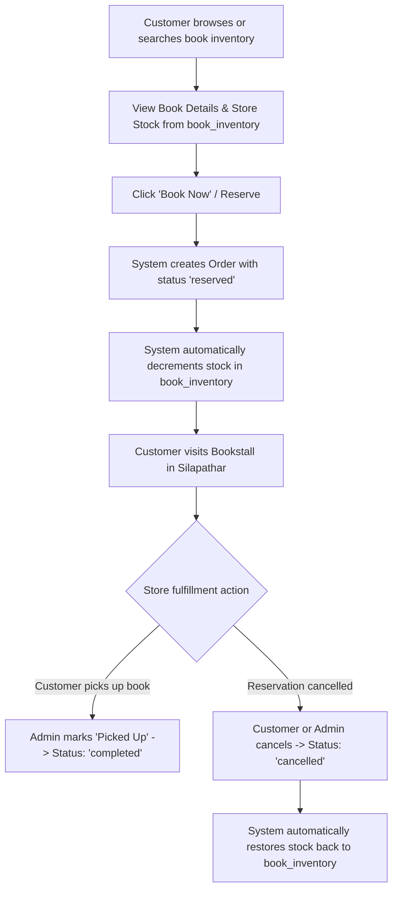

# 📚 BookStack Silapathar - Town Bookstall Marketplace & Reservation Platform

> A modern, full-stack web application connecting readers with local bookstalls in **Silapathar**. Browse inventory across local stores, search books in real-time, reserve copies for offline pickup, and manage sales via an integrated administrative dashboard.

---

## Live Demo
https://bookstack-silapathar.vercel.app/

## GitHub Repository
https://github.com/KARANDZ/BookStack-Silapathar

## 📋 Table of Contents

- [Overview](#-overview)
- [Key Features](#-key-features)
  - [Customer Portal](#customer-portal)
  - [Store Admin Portal](#store-admin-portal-store_owner--admin)
  - [Admin Panel](#admin-panel-admin-only)
  - [Role-Based Access Control (RBAC)](#role-based-access-control-rbac)
- [Tech Stack](#-tech-stack)
- [Database Schema & Architecture](#-database-schema--architecture)
- [Recent Updates & Architecture Refactoring](#-recent-updates--architecture-refactoring)
- [Project Directory Structure](#-project-directory-structure)
- [API Reference](#-api-reference)
- [Getting Started](#-getting-started)
  - [Prerequisites](#prerequisites)
  - [Environment Configuration](#environment-configuration)
  - [Database Setup (Supabase)](#database-setup-supabase)
  - [Installation & Local Development](#installation--local-development)
- [Workflow & Order Lifecycle](#-workflow--order-lifecycle)
- [Future Enhancements](#-future-enhancements)

---

## 🌟 Overview

**LocalBookHub** solves a common local commerce problem: book lovers often don't know which local bookstore has a specific book in stock, leading to wasted store visits or turning to giant online e-commerce platforms. 

LocalBookHub bridges this gap by aggregating local bookstall inventories into a central, searchable marketplace. Customers can instantly search for titles, authors, categories, or specific bookstores in **Silapathar**, check live stock levels, and reserve books for store pickup. Local bookstall owners gain access to an intuitive admin dashboard to track revenue, fulfill reservations, and manage inventory.

---

## ✨ Key Features

### Customer Portal
- 🏪 **Bookstall Directory**: Browse local bookstalls in Silapathar with store logos, addresses, and contact info.
- 🔍 **Multi-Field Real-Time Search**: Search by title, author, category, or bookstore name across all participating bookstalls.
- 📖 **Detailed Inventory Views**: Inspect store-specific book availability, pricing, descriptions, cover images, and stock status.
- 🛍️ **Instant Book Reservation**: Reserve books online for physical store pickup without upfront payment ("Pay at Store / Offline").
- 📜 **Booking Tracking & Customer Cancellation**: Track reservation history, view pickup details, and cancel reservations with automatic stock restoration back to store inventory.

### Store Admin Portal (STORE_OWNER & ADMIN)
- 🏪 **Store-Scoped Order Management**: View and fulfill customer pick-up reservations placed specifically at owned bookstores.
- 🏷️ **Inventory & Price Management**: Adjust live stock levels and store prices in real-time per bookstore.
- 📚 **Catalog & Inventory Addition**: Add existing catalog titles or list new books safely via atomic stored functions (`add_new_catalog_book_and_inventory`).
- ❌ **Order Fulfillment & Cancellation**: Mark store pick-ups completed or process order cancellations with automatic stock restoration.

### Admin Panel (ADMIN Only)
- 📊 **Analytics Dashboard**: Real-time business metrics including Total Orders, Pending Pickups, Completed Count, Cancelled Count, and Total Revenue (₹).
- 👥 **User & Role Management**: Inspect registered platform users and elevate roles (`USER`, `STORE_OWNER`, `ADMIN`) securely via `admin_change_user_role`.
- 📦 **Global Order Fulfillment**: Review and fulfill incoming book pickup reservations across all bookstores platform-wide.
- ✅ **Pick-up Completion & Cancellation**: Fulfill orders or process cancellations with automatic stock restoration back to `book_inventory`.

### Role-Based Access Control (RBAC)
- 👤 **USER**: Customer role assigned automatically upon registration. Can browse stores, search books, reserve copies, and cancel their own bookings from any store.
- 🏪 **STORE_OWNER**: Assigned by Admin. Manages store inventory and customer reservations for owned bookstores while retaining full customer functionality under My Bookings.
- ⚙️ **ADMIN**: Full platform access. Manages global catalog, all store orders, system metrics, and user roles.

---

## 🛠️ Tech Stack

### Frontend & Core
- **Framework**: [Next.js 14](https://nextjs.org/) (Pages Router)
- **UI Library**: [React 18](https://react.dev/)
- **Styling**: [Tailwind CSS v3](https://tailwindcss.com/) with PostCSS & Autoprefixer
- **State & Auth Context**: React Context API (`AuthContext`) managing Supabase Auth sessions & roles
- **Data Fetching**: Supabase JS SDK (`@supabase/supabase-js`)

### Backend & Database
- **Database & Auth**: [Supabase](https://supabase.com/) (PostgreSQL) with Supabase Auth
- **Authorization & Security**: PostgreSQL Row-Level Security (RLS) policies, PL/pgSQL `SECURITY DEFINER` RPC functions with atomic row locking (`FOR UPDATE`), and role security triggers
- **API Engine**: Next.js Serverless API Routes (`/pages/api/*`)
- **Database Extension**: PostgreSQL `pgcrypto` for UUID generation

---

## 🗄️ Database Schema & Architecture

The database follows a **normalized relational architecture** on PostgreSQL hosted on Supabase:

### 1. Master Catalog vs. Store Inventory

- **`books` (Master Catalog)**: Contains master information about books (`id`, `title`, `author`, `isbn`, `category`, `description`, `image_url`). It represents *what books exist in the system*, independent of store stock.
- **`book_inventory` (Store Inventory Source of Truth)**: Maps `(book_id + bookstall_id)` with store-specific `stock` and `price`. This table is the **single source of truth** for availability.

### Data Models

```sql
-- Enum for User Roles
create type public.user_role as enum ('USER', 'STORE_OWNER', 'ADMIN');

-- 1. Users Table (Linked to auth.users)
create table public.users (
  id uuid primary key references auth.users(id) on delete cascade,
  name text,
  email text unique,
  role public.user_role not null default 'USER'::public.user_role,
  created_at timestamptz default now()
);

-- 2. Bookstalls Table
create table public.bookstalls (
  id uuid primary key default gen_random_uuid(),
  name text not null,
  address text,
  city text not null default 'Silapathar',
  phone text,
  logo_url text,
  owner_id uuid references public.users(id),
  created_at timestamptz default now()
);

-- 3. Books Table (Master Catalog)
create table public.books (
  id uuid primary key default gen_random_uuid(),
  title text not null,
  author text,
  isbn text,
  image_url text,
  category text,
  description text,
  price numeric(10,2),
  bookstall_id uuid references public.bookstalls(id),
  created_at timestamptz default now()
);

-- 4. Book Inventory Table (Single Source of Truth for Stock & Price)
create table public.book_inventory (
  id uuid primary key default gen_random_uuid(),
  book_id uuid references public.books(id) on delete cascade,
  bookstall_id uuid references public.bookstalls(id) on delete cascade,
  stock integer not null default 0,
  price numeric(10,2) not null,
  created_at timestamptz default now()
);

-- 5. Orders Table
create type order_status as enum ('pending', 'reserved', 'completed', 'cancelled');

create table public.orders (
  id uuid primary key default gen_random_uuid(),
  user_id uuid references public.users(id),
  bookstall_id uuid references public.bookstalls(id),
  total_amount numeric(10,2) default 0,
  status order_status default 'pending',
  payment_method text default 'offline',
  created_at timestamptz default now()
);

-- 6. Order Items Table
create table public.order_items (
  id uuid primary key default gen_random_uuid(),
  order_id uuid references public.orders(id) on delete cascade,
  book_id uuid references public.books(id),
  quantity integer not null default 1,
  price_at_purchase numeric(10,2) not null
);
```

### Security & Database Stored Functions (RPCs)
- **`create_reservation_tx(p_inventory_id, p_quantity)`**: Performs atomic row locking (`FOR UPDATE`) on `book_inventory`, decrements stock, creates order and order item records.
- **`cancel_reservation_tx(p_order_id)`**: Cancels reservation with atomic stock restoration. Authorizes user (own booking from any store), store owner (own store reservations), or admin.
- **`complete_reservation_tx(p_order_id)`**: Marks reservation completed. Authorizes store owner (own store) or admin.
- **`add_new_catalog_book_and_inventory(...)`**: Safely adds master book catalog entry and store inventory entry.
- **`admin_change_user_role(p_target_user_id, p_new_role)`**: Admin-only RPC to elevate user roles.
- **`enforce_user_role_security()`**: Database trigger preventing non-admin users from altering their role column.

---

## ⚡ Recent Updates & Architecture Refactoring

### 1. `book_inventory` Single Source of Truth Restoration
- Updated all frontend pages (`/search`, `/stall/[id]`, `/book/[id]`) and backend API routes (`/api/orders`, `/api/books/search`) to query `book_inventory` joined with `books` and `bookstalls`.
- Fixed book availability logic so stock and price read directly from `book_inventory.stock` and `book_inventory.price`.
- Restored store page metrics so "Titles Available" is calculated from active store inventory records.

### 2. Multi-Field Search & Live Filters
- Expanded `/search` and `/api/books/search` to search across book title, author, category, and bookstore name.
- Added live clear button, loading skeletons, and interactive search feedback.

### 3. Order Management & Automated Stock Restoration
- Updated reservation placement (`/api/orders`) to validate stock against `book_inventory.stock` and decrement `book_inventory.stock`.
- Added customer-side cancellation on `/bookings` with stock restoration back to `book_inventory`.
- Updated admin order cancellation (`/admin/orders`) to safely loop through order items and restore stock to `book_inventory`.
- Corrected status badge color coding (`reserved` = Amber, `completed` = Emerald, `cancelled` = Rose).

### 4. UI & Aesthetic Overhaul
- Redesigned header with glassmorphism backdrop, brand logo badge, and active link highlights.
- Added image error fallback handlers for books and store logos.
- Updated store directory, book detail view, and admin metrics cards with clean modern styling.
### 4. Modern UI / UX Redesign

The user interface was completely modernized to provide a cleaner and more intuitive experience while preserving the original functionality.

#### Improvements

- Redesigned responsive homepage with improved visual hierarchy.
- Modernized search interface with loading states and interactive feedback.
- Redesigned Book Cards with inventory badges, pricing emphasis, and better spacing.
- Improved bookstore directory layout and navigation.
- Enhanced Book Detail pages with cleaner information hierarchy.
- Refined Admin Dashboard using modern analytics cards and improved action buttons.
- Added consistent color palette, rounded components, improved shadows, and hover animations.
- Improved responsive behavior for desktop, tablet, and mobile devices.
- Added image fallback handling for books and bookstore logos.
- Improved typography and spacing across the application.
### 5. Full Role-Based Access Control (RBAC), Supabase Auth & Secure RPC Transactions
- Integrated Supabase Auth with React `AuthContext` for login, signup, and session management across the application.
- Implemented 3 strict roles (`USER`, `STORE_OWNER`, `ADMIN`) with `public.users.role` as single source of truth.
- Created `prisma/rbac_setup.sql` containing enum `user_role`, foreign key linking `public.users.id` to `auth.users(id)`, RLS policies across all 6 tables, and role security trigger `enforce_user_role_security`.
- Hardened database operations with atomic `SECURITY DEFINER` RPC functions (`create_reservation_tx`, `cancel_reservation_tx`, `complete_reservation_tx`, `add_new_catalog_book_and_inventory`, `admin_change_user_role`).
- Protected `/admin/*` routes strictly for `ADMIN` and `/store-admin/*` routes for `STORE_OWNER` & `ADMIN`.

---

## 📁 Project Directory Structure

```text
localbookhub_full/
├── components/            # Reusable UI Components
│   ├── BookCard.js        # Card component receiving inventory (stock, price, books, bookstalls)
│   ├── Header.js          # Main navigation bar (Home, Search, My Bookings, Store Admin, Admin Panel)
│   ├── Layout.js          # Global page layout container wrapper with footer
│   └── StallCard.js       # Bookstall card component for directory listing
├── context/               # React Context
│   └── AuthContext.js     # Supabase Auth session, role tracking, signIn, signUp & signOut
├── lib/
│   └── supabaseClient.js  # Supabase client instantiation (@supabase/supabase-js)
├── pages/                 # Next.js Pages & Routing
│   ├── _app.js            # Custom App component wrapping AuthProvider & global CSS
│   ├── index.js           # Homepage (Bookstall Directory for Silapathar)
│   ├── search.js          # Search page querying book_inventory
│   ├── bookings.js        # Customer reservation history & self-cancellation
│   ├── login.js           # User sign-in page
│   ├── signup.js          # User registration page (defaults to USER role)
│   ├── store-admin/       # Store Owner Portal (STORE_OWNER / ADMIN)
│   │   ├── inventory.js   # Store stock, pricing, and catalog addition RPC
│   │   └── orders.js      # Store pickup reservations & fulfillment
│   ├── admin/             # Administrative Management Module (ADMIN only)
│   │   ├── index.js       # Admin panel navigation hub
│   │   ├── dashboard.js   # Real-time revenue & order statistics
│   │   ├── orders.js      # Global platform order fulfillment
│   │   └── users.js       # Admin user listing & role elevation management
│   ├── api/               # Serverless REST API Handlers
│   │   ├── bookstalls.js  # GET: Fetch all registered bookstalls
│   │   ├── orders.js      # POST: Authenticated reservation placement via create_reservation_tx
│   │   ├── books/
│   │   │   └── search.js  # GET: Search book_inventory endpoint
│   │   └── stalls/
│   │       └── [id]/
│   │           └── books.js # GET: Fetch inventory for specific stall
│   ├── book/
│   │   └── [id].js        # Detailed book & store inventory reservation page
│   └── stall/
│       └── [id].js        # Individual bookstall showcase & store inventory page
├── prisma/
│   ├── schema.sql         # Base PostgreSQL schema definition
│   └── rbac_setup.sql     # Complete Supabase RBAC migration script (Enum, Triggers, RPCs, RLS Policies)
├── public/                # Static assets (images, logos, placeholders)
├── styles/
│   └── globals.css        # Tailwind CSS directives & global styling rules
├── .env.local.example     # Environment variable template
├── next.config.js         # Next.js configuration
├── package.json           # Project dependencies & scripts
├── postcss.config.js      # PostCSS configuration
└── tailwind.config.js     # Tailwind CSS design system configuration
```

---

## 🔌 API Reference

### 1. `GET /api/bookstalls`
- **Description**: Returns all registered bookstalls ordered by name.
- **Response**: Array of bookstall objects (`id`, `name`, `address`, `city`, `phone`, `logo_url`).

### 2. `GET /api/books/search?q={query}`
- **Description**: Searches `book_inventory` joined with `books` and `bookstalls` by title, author, category, or store name.
- **Parameters**: `q` (Search string).
- **Response**: Array of `book_inventory` objects with joined `books` and `bookstalls`.

### 3. `GET /api/stalls/[id]/books`
- **Description**: Retrieves all inventory items available at a specific bookstall.
- **Response**: Array of `book_inventory` objects belonging to the store.

### 4. `POST /api/orders`
- **Description**: Core transaction handler to place a book reservation.
- **Request Body**:
  ```json
  {
    "inventory_id": "UUID",
    "quantity": 1
  }
  ```
- **Execution Flow**:
  1. Validates stock availability against `book_inventory`.
  2. Inserts order record into `orders` with status `'reserved'`.
  3. Inserts order item line in `order_items`.
  4. Atomically decrements `stock` count in the `book_inventory` table.
- **Response**: `{ "success": true, "message": "Book reserved successfully", "order_id": "UUID" }`

---

## 🚀 Getting Started

### Prerequisites
- **Node.js**: `v18.0.0` or higher
- **npm**: `v9.0.0` or higher
- **Supabase Account**: A free account on [Supabase.com](https://supabase.com/)

---

### Environment Configuration

1. Create a `.env.local` file in the root directory by copying `.env.local.example`:

   ```bash
   cp .env.local.example .env.local
   ```

2. Configure your Supabase project credentials in `.env.local`:

   ```env
   NEXT_PUBLIC_SUPABASE_URL=https://<your-project-id>.supabase.co
   NEXT_PUBLIC_SUPABASE_ANON_KEY=<your-supabase-anon-key>
   SUPABASE_SERVICE_ROLE_KEY=<your-supabase-service-role-key>
   NEXT_PUBLIC_SITE_NAME=LocalBookHub
   ```

---

### Database Setup (Supabase)

1. Log into your **Supabase Dashboard** and create a new PostgreSQL project.
2. Open the **SQL Editor** tab in your Supabase dashboard.
3. Open [`prisma/rbac_setup.sql`](file:///c:/Users/das65/OneDrive/Desktop/localbookhub_full/prisma/rbac_setup.sql) from this repository.
4. Copy and paste the script into the Supabase SQL Editor and click **Run**.
5. Ensure tables (`users`, `bookstalls`, `books`, `book_inventory`, `orders`, `order_items`), enum `user_role`, security triggers, RLS policies, and RPC stored functions are created successfully.

---

### Installation & Local Development

1. **Install Dependencies**:
   ```bash
   npm install
   ```

2. **Run Development Server**:
   ```bash
   npm run dev
   ```

3. **Access Application**:
   Open your browser and navigate to `http://localhost:3000`.

4. **Build for Production**:
   ```bash
   npm run build
   npm start
   ```

---

## 🔄 Workflow & Order Lifecycle



---

## 💡 Future Enhancements

- [x] 🔐 **User Authentication & RBAC**: Complete integration with Supabase Auth for customer logins & role-based access control (`USER`, `STORE_OWNER`, `ADMIN`).
- 💳 **Online Payment Gateway**: Integration with Razorpay / UPI for optional advance payment.
- 📍 **Geolocation & Map View**: Interactive map showing bookstall locations in Silapathar.
- 🔔 **SMS / WhatsApp Notifications**: Instant notification alerts to bookstall owners when new reservations are placed.

---

## 📄 License & Credits

Designed & Developed for **BookStack Silapathar**. Built with Next.js, Tailwind CSS, and Supabase.