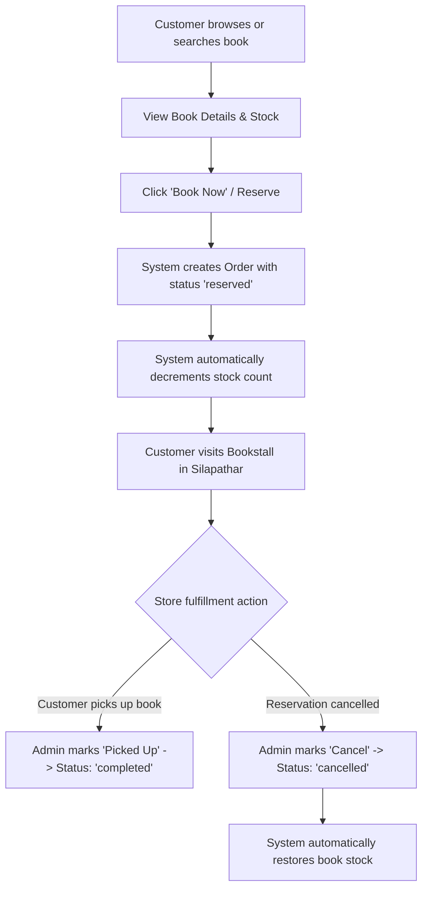

# 📚 LocalBookHub - Town Bookstall Marketplace & Reservation Platform

> A modern, full-stack web application connecting readers with local bookstalls in **Silapathar**. Browse inventory across local stores, search books in real-time, reserve copies for offline pickup, and manage sales via an integrated administrative dashboard.

---

## 📋 Table of Contents

- [Overview](#-overview)
- [Key Features](#-key-features)
  - [Customer Portal](#customer-portal)
  - [Admin Panel](#admin-panel)
- [Tech Stack](#-tech-stack)
- [Database Schema & Architecture](#-database-schema--architecture)
- [Project Directory Structure](#-project-directory-structure)
- [API Reference](#-api-reference)
- [Getting Started](#-getting-started)
  - [Prerequisites](#prerequisites)
  - [Environment Configuration](#environment-configuration)
  - [Database Setup (Supabase)](#database-setup-supabase)
  - [Installation & Local Development](#installation--local-development)
- [Workflow & Order Lifecycle](#-workflow--order-lifecycle)
- [Future Enhancements](#-future-enhancements)

---

## 🌟 Overview

**LocalBookHub** solves a common local commerce problem: book lovers often don't know which local bookstore has a specific book in stock, leading to wasted store visits or turning to giant online e-commerce platforms. 

LocalBookHub bridges this gap by aggregating local bookstall inventories into a central, searchable marketplace. Customers can instantly search for titles or authors across all registered stalls in **Silapathar**, check live stock levels, and reserve books for store pickup. Local bookstall owners gain access to an intuitive admin dashboard to track revenue, fulfill reservations, and manage inventory.

---

## ✨ Key Features

### Customer Portal
- 🏪 **Bookstall Directory**: Browse local bookstalls in Silapathar with store logos, addresses, and contact info.
- 🔍 **Real-Time Book Search**: Instant keyword search for book titles and authors across all participating bookstalls.
- 📖 **Detailed Inventory Views**: Inspect store-specific book availability, pricing, descriptions, cover images, and stock status.
- 🛍️ **Instant Book Reservation**: Reserve books online for physical store pickup without upfront payment ("Pay at Store / Offline").
- 📜 **Booking Tracking ("My Bookings")**: Track reservation history and live status (*Reserved*, *Completed*, or *Cancelled*).

### Admin Panel
- 📊 **Analytics Dashboard**: Real-time business metrics including Total Orders, Reserved Count, Completed Count, Cancelled Count, and Total Revenue (₹).
- 📦 **Order Fulfillment**: Review incoming book pickup reservations with customer itemized order breakdowns.
- ✅ **Pick-up Completion**: Mark orders as "Picked Up" once customers collect their reserved books.
- ❌ **Order Cancellation & Stock Restoration**: Cancel orders with automatic, real-time inventory restoration back to the database.

---

## 🛠️ Tech Stack

### Frontend & Core
- **Framework**: [Next.js 14](https://nextjs.org/) (Pages Router)
- **UI Library**: [React 18](https://react.dev/)
- **Styling**: [Tailwind CSS v3](https://tailwindcss.com/) with PostCSS & Autoprefixer
- **Data Fetching**: [SWR](https://swr.vercel.app/) & Supabase JS SDK

### Backend & Database
- **Database & Auth**: [Supabase](https://supabase.com/) (PostgreSQL)
- **API Engine**: Next.js Serverless API Routes (`/pages/api/*`)
- **Database Extension**: PostgreSQL `pgcrypto` for UUID generation
- **Search Engine**: PostgreSQL Full-Text Search GIN indexing (`to_tsvector`)

---

## 🗄️ Database Schema & Architecture

The database is built on PostgreSQL hosted on Supabase. Below is the relational structure defined in [`prisma/schema.sql`](file:///c:/Users/das65/OneDrive/Desktop/localbookhub_full/prisma/schema.sql):

### Data Models

```sql
-- 1. Users Table
create table users (
  id uuid primary key default gen_random_uuid(),
  name text,
  email text unique,
  created_at timestamptz default now()
);

-- 2. Bookstalls Table
create table bookstalls (
  id uuid primary key default gen_random_uuid(),
  name text not null,
  address text,
  city text not null default 'Silapathar',
  phone text,
  logo_url text,
  owner_id uuid references users(id),
  created_at timestamptz default now()
);

-- 3. Books & Inventory Table
create table books (
  id uuid primary key default gen_random_uuid(),
  bookstall_id uuid references bookstalls(id) on delete cascade,
  title text not null,
  author text,
  isbn text,
  price numeric(10,2) not null,
  stock integer default 0,
  image_url text,
  category text,
  description text,
  created_at timestamptz default now()
);

-- 4. Order Status Enum & Orders Table
create type order_status as enum ('pending', 'reserved', 'completed', 'cancelled');

create table orders (
  id uuid primary key default gen_random_uuid(),
  user_id uuid references users(id),
  bookstall_id uuid references bookstalls(id),
  total_amount numeric(10,2) default 0,
  status order_status default 'pending',
  payment_method text,
  created_at timestamptz default now()
);

-- 5. Order Items Table
create table order_items (
  id uuid primary key default gen_random_uuid(),
  order_id uuid references orders(id) on delete cascade,
  book_id uuid references books(id),
  quantity integer not null default 1,
  price_at_purchase numeric(10,2) not null
);

-- Full-Text Search Index
create index idx_books_title on books using gin (to_tsvector('english', coalesce(title,'') || ' ' || coalesce(author,'')));
```

---

## 📁 Project Directory Structure

```text
localbookhub_full/
├── components/            # Reusable UI Components
│   ├── BookCard.js        # Individual book display card with reservation action
│   ├── Header.js          # Main navigation bar (Home, Search, My Bookings, Admin)
│   ├── Layout.js          # Global page layout container wrapper
│   └── StallCard.js       # Bookstall card component for directory listing
├── lib/
│   └── supabaseClient.js  # Supabase client instantiation (@supabase/supabase-js)
├── pages/                 # Next.js Pages & Routing
│   ├── _app.js            # Custom App component & global CSS imports
│   ├── index.js           # Homepage (Bookstall Directory for Silapathar)
│   ├── search.js          # Search page for books by title or author
│   ├── bookings.js        # Customer reservation history & status tracking
│   ├── admin/             # Administrative Management Module
│   │   ├── index.js       # Admin panel navigation hub
│   │   ├── dashboard.js   # Real-time revenue & order statistics
│   │   └── orders.js      # Order fulfillment (Mark Completed / Cancel Order)
│   ├── api/               # Serverless REST API Handlers
│   │   ├── bookstalls.js  # GET: Fetch all registered bookstalls
│   │   ├── orders.js      # POST: Create order reservation & update stock
│   │   ├── books/
│   │   │   └── search.js  # GET: Search books endpoint
│   │   └── stalls/
│   │       └── [id]/
│   │           └── books.js # GET: Fetch inventory for specific stall
│   ├── book/
│   │   └── [id].js        # Detailed book view and booking page
│   └── stall/
│       └── [id].js        # Individual bookstall showcase page
├── prisma/
│   └── schema.sql         # PostgreSQL schema definition & initial setup script
├── public/                # Static assets (images, logos, placeholders)
├── styles/
│   └── globals.css        # Tailwind CSS directives & global styling rules
├── .env.local.example     # Environment variable template
├── next.config.js         # Next.js configuration
├── package.json           # Project dependencies & scripts
├── postcss.config.js      # PostCSS configuration
└── tailwind.config.js     # Tailwind CSS design system configuration
```

---

## 🔌 API Reference

### 1. `GET /api/bookstalls`
- **Description**: Returns all registered bookstalls ordered by creation date.
- **Response**: Array of bookstall objects (`id`, `name`, `address`, `city`, `phone`, `logo_url`).

### 2. `GET /api/books/search?q={query}`
- **Description**: Performs a case-insensitive search (`ilike`) on book titles and authors.
- **Parameters**: `q` (Search string).
- **Response**: Array of matching book objects joined with store details (`bookstalls`).

### 3. `GET /api/stalls/[id]/books`
- **Description**: Retrieves all books available at a specific bookstall.
- **Response**: Array of book inventory objects belonging to the store.

### 4. `POST /api/orders`
- **Description**: Core transaction handler to place a book reservation.
- **Request Body**:
  ```json
  {
    "bookstall_book_id": "UUID",
    "quantity": 1
  }
  ```
- **Execution Flow**:
  1. Validates stock availability.
  2. Inserts order record into `orders` with status `'reserved'`.
  3. Inserts order item line in `order_items`.
  4. Atomically decrements `stock` count in the `books` table.
- **Response**: `{ "message": "Book reserved successfully", "order_id": "UUID" }`

---

## 🚀 Getting Started

### Prerequisites
- **Node.js**: `v18.0.0` or higher
- **npm**: `v9.0.0` or higher
- **Supabase Account**: A free account on [Supabase.com](https://supabase.com/)

---

### Environment Configuration

1. Create a `.env.local` file in the root directory by copying `.env.local.example`:

   ```bash
   cp .env.local.example .env.local
   ```

2. Configure your Supabase project credentials in `.env.local`:

   ```env
   NEXT_PUBLIC_SUPABASE_URL=https://<your-project-id>.supabase.co
   NEXT_PUBLIC_SUPABASE_ANON_KEY=<your-supabase-anon-key>
   SUPABASE_SERVICE_ROLE_KEY=<your-supabase-service-role-key>
   NEXT_PUBLIC_SITE_NAME=LocalBookHub
   ```

---

### Database Setup (Supabase)

1. Log into your **Supabase Dashboard** and create a new PostgreSQL project.
2. Open the **SQL Editor** tab in your Supabase dashboard.
3. Open [`prisma/schema.sql`](file:///c:/Users/das65/OneDrive/Desktop/localbookhub_full/prisma/schema.sql) from this repository.
4. Copy and paste the entire script into the Supabase SQL Editor and click **Run**.
5. Ensure tables (`users`, `bookstalls`, `books`, `orders`, `order_items`) and enum types are created successfully.

---

### Installation & Local Development

1. **Install Dependencies**:
   ```bash
   npm install
   ```

2. **Run Development Server**:
   ```bash
   npm run dev
   ```

3. **Access Application**:
   Open your browser and navigate to `http://localhost:3000`.

4. **Build for Production**:
   ```bash
   npm run build
   npm start
   ```

---

## 🔄 Workflow & Order Lifecycle



---

## 💡 Future Enhancements

- 🔐 **User Authentication**: Complete integration with Supabase Auth for customer logins & store owner role-based access control.
- 💳 **Online Payment Gateway**: Integration with Razorpay / UPI for optional advance payment.
- 📍 **Geolocation & Map View**: Interactive map showing bookstall locations in Silapathar.
- 🔔 **SMS / WhatsApp Notifications**: Instant notification alerts to bookstall owners when new reservations are placed.

---

## 📄 License & Credits

Designed & Developed for **LocalBookHub Silapathar**. Built with Next.js, Tailwind CSS, and Supabase.
